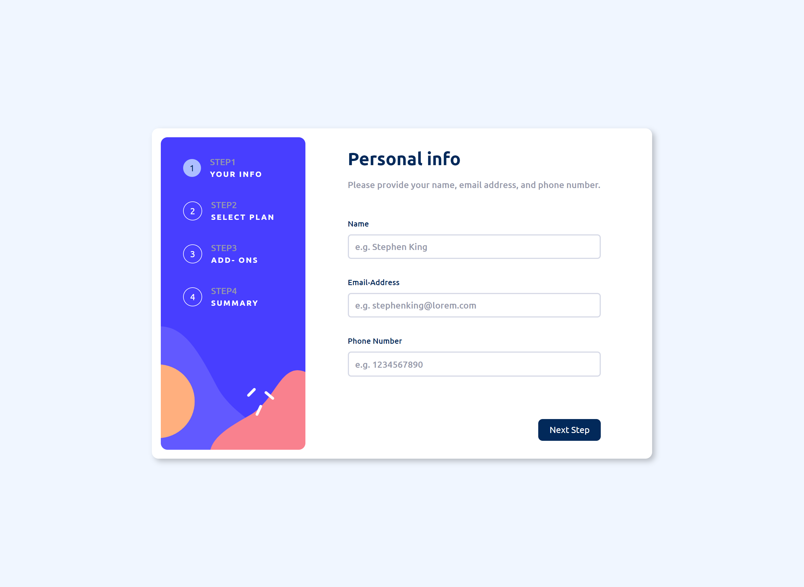

# Frontend Mentor - Multi-step form solution

This project is a React app that implements a multi-step form user interface.

## Overview

### The challenge

Users should be able to:

- Complete each step of the sequence
- Go back to a previous step to update their selections
- See a summary of their selections on the final step and confirm their order
- View the optimal layout for the interface depending on their device's screen size
- See hover and focus states for all interactive elements on the page
- Receive form validation messages if:
  - A field has been missed
  - The email address is not formatted correctly
  - A step is submitted, but no selection has been made

### Screenshot

### Links

- Solution URL: [Add solution URL here](https://github.com/yonathan-palma/multi-step-form-main)
- Live Site URL: [Add live site URL here](https://yonathan-palma.github.io/multi-step-form-main/)

## My process

### Built with

- Semantic HTML5 markup
- CSS custom properties
- Flexbox
- CSS Grid
- Mobile-first workflow
- [React](https://reactjs.org/) - JS library

## Usage

- To launch the app, run this command: npm run dev

## Author

- Website - [Yonathan Palma](https://github.com/yonathan-palma)
- Frontend Mentor - [@yonathan-palma](https://www.frontendmentor.io/profile/yonathan-palma)
